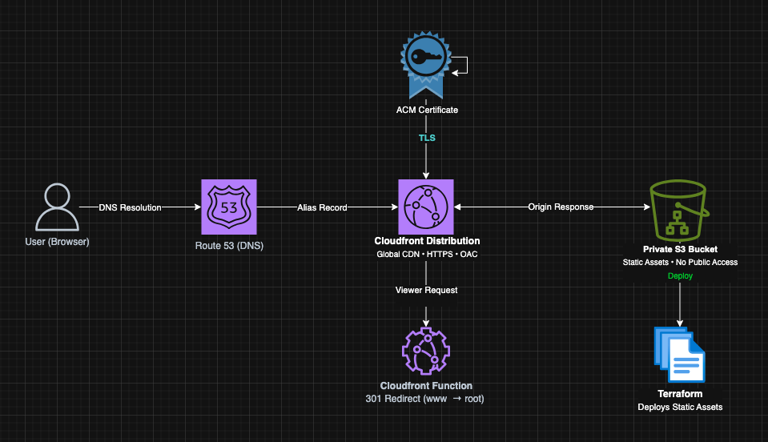
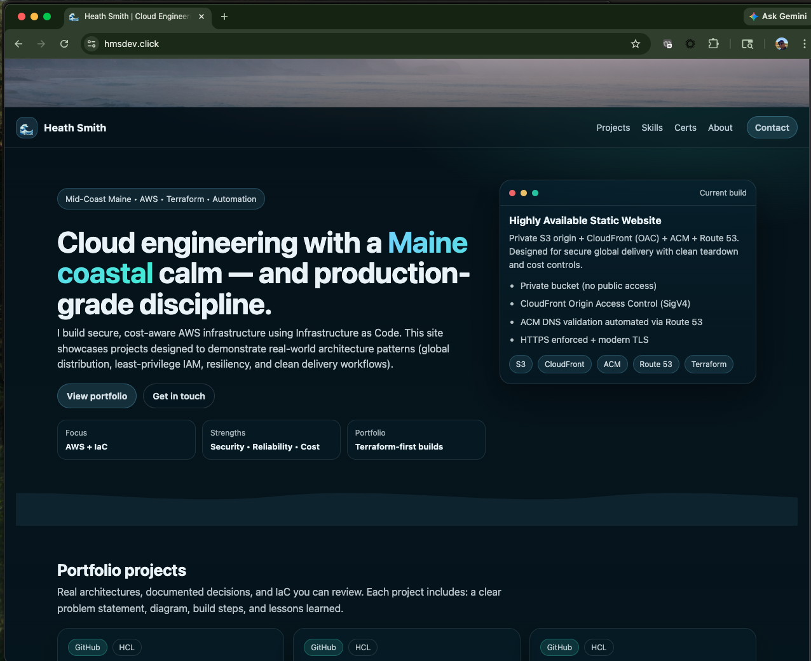

# Highly Available Static Website on AWS (Terraform)

A production-grade static website platform built on AWS using Terraform, designed with a strong emphasis on **security, scalability, and real-world infrastructure patterns**.

This project showcases modern cloud architecture practices including **private S3 origins, CloudFront edge distribution, HTTPS enforcement, and multi-environment infrastructure design (dev/prod)**.

---

##  What This Project Demonstrates

- Secure static hosting using **private S3 + CloudFront**
- Global content delivery via **AWS edge locations**
- HTTPS with **ACM-managed certificates**
- DNS routing using **Route 53 alias records**
- **Multi-environment infrastructure (dev/prod)**
- Infrastructure as Code using **Terraform best practices**
- Environment isolation and reusable configuration patterns

---

##  Architecture Overview

All traffic is routed through CloudFront, ensuring the S3 origin remains private and inaccessible from the public internet.



### Core AWS Services

- **Amazon S3**
  - Hosts static assets
  - Public access fully blocked

- **Amazon CloudFront**
  - Global CDN distribution
  - HTTPS enforcement
  - Origin Access Control (OAC) for secure S3 access

- **AWS Certificate Manager (ACM)**
  - TLS certificate (must reside in us-east-1 for CloudFront)

- **Amazon Route 53**
  - Custom domain routing via ALIAS record

---

##  Environment Strategy

This project is structured to support **multiple isolated environments**, enabling safe development and production deployments.

### Environments

- **dev**
  - Used for testing and iteration
  - Lower-cost, rapid deployment cycles

- **prod**
  - Production-ready configuration
  - Stable and optimized for reliability

Each environment maintains:
- Separate Terraform state
- Independent resource naming
- Environment-specific variables

---

##  Project Structure

```
.
├── site/                      # Static frontend assets
├── terraform/
│   ├── modules/               # Reusable infrastructure modules
│   ├── environments/
│   │   ├── dev/
│   │   └── prod/
│   └── backend.tf             # Remote state configuration (optional)
```

---

##  Security Design

- S3 bucket is **not publicly accessible**
- Access restricted via **CloudFront Origin Access Control (OAC)**
- HTTPS enforced at the edge
- Direct access to S3 is explicitly denied via bucket policy
- Environment isolation prevents cross-environment impact

---

##  Cost Optimization

- S3 storage: minimal cost
- CloudFront: free tier eligible for low traffic
- Route 53: ~$0.50/month per hosted zone
- ACM: free

---

##  Deployment

> Note: Ensure AWS credentials are configured before running Terraform commands. 
> This project assumes deployment in the us-east-1 region for ACM compatibility with CloudFront.

### Deploy to Dev

```bash
cd terraform/environments/dev

terraform init
terraform plan -out=tfplan
terraform apply tfplan
```

### Deploy to Prod

```bash
cd terraform/environments/prod

terraform init
terraform plan -out=tfplan
terraform apply tfplan
```

---

## Engineering Highlights

- Implementing secure S3 origins using CloudFront OAC
- Managing DNS validation for ACM certificates
- Designing multi-environment Terraform architectures
- Structuring reusable infrastructure modules
- Separating state and configuration per environment
- Applying production-grade IaC workflows

---

## Why This Architecture Matters

This project demonstrates how to securely serve static content at scale using AWS-native services while minimizing attack surface.

By combining CloudFront with a private S3 origin and enforcing HTTPS at the edge, the architecture ensures:
- No direct public access to backend storage
- Low-latency global delivery
- Scalable and cost-efficient infrastructure

##  Demo



---

##  Future Enhancements

- CI/CD pipeline using GitHub Actions + OIDC
- Automated cache invalidation on deploy
- Custom error pages via CloudFront
- WAF integration for edge security
- Logging and monitoring (CloudFront + S3 access logs)

---

##  Live Demo

https://dev.hmsdev.click  
https://www.hmsdev.click

---

##  Tech Stack

**AWS | Terraform | CloudFront | S3 | Route 53 | ACM**
