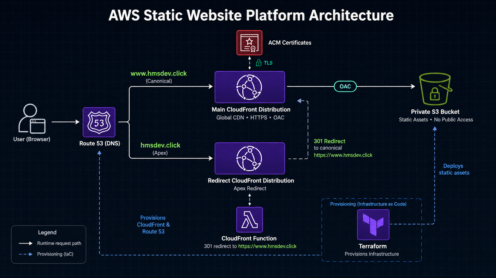
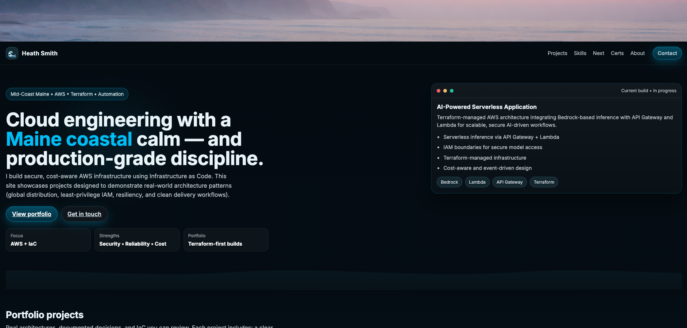

# Secure Static Website on AWS with Terraform

A production-oriented static website platform built on AWS using Terraform. The project demonstrates private S3 hosting behind CloudFront, HTTPS with ACM, Route 53 DNS, canonical-domain redirects, isolated DEV and PROD Terraform environments, remote state, and controlled CI/CD through GitHub Actions and AWS OIDC.

The production site is designed around `www.hmsdev.click` as the canonical hostname. Requests to the apex domain are redirected to `https://www.hmsdev.click` through a dedicated CloudFront redirect distribution and CloudFront Function.

## Architecture



The runtime architecture separates canonical-site delivery from apex-domain redirection.

```text
www.hmsdev.click
      │
      ▼
Main CloudFront Distribution
      │
     OAC
      │
      ▼
Private S3 Bucket
```

Production apex requests follow a separate redirect path:

```text
hmsdev.click
      │
      ▼
Redirect CloudFront Distribution
      │
      ▼
CloudFront Function
      │
      ▼
301 → https://www.hmsdev.click
```

Route 53 provides DNS resolution for both paths, while ACM certificates in `us-east-1` provide TLS support for CloudFront.

## Application Preview



The frontend is deployed from the `site/` directory and is published to the private S3 origin through Terraform-managed `aws_s3_object` resources.

## Key Design Decisions

### Private S3 origin with CloudFront OAC

The S3 bucket is not publicly accessible.

Public access is blocked at the bucket level, and CloudFront Origin Access Control (OAC) is used to authorize CloudFront access to the origin.

This keeps direct public traffic away from S3 while allowing CloudFront to serve the website globally.

### Canonical `www` production domain

Production uses:

```text
https://www.hmsdev.click
```

as the canonical site hostname.

Requests to:

```text
https://hmsdev.click
```

are handled by a dedicated CloudFront redirect distribution. A CloudFront Function returns a permanent `301` redirect to the corresponding `www` URL.

This keeps canonicalization at the edge rather than relying on application logic.

### HTTPS and ACM

CloudFront uses ACM-managed certificates created in:

```text
us-east-1
```

as required for CloudFront custom-domain certificates.

The main distribution uses:

```text
TLSv1.2_2021
```

as its minimum TLS protocol version.

### Terraform-managed static assets

Website files are deployed declaratively using `aws_s3_object`.

The module uses each file's MD5 hash as the S3 object ETag so Terraform can detect content changes and update the corresponding object.

### CloudFront cache invalidation

The controlled Apply workflow invalidates frequently changed application paths after a successful deployment:

```text
/index.html
/app.js
/assets/*
```

This reduces the chance of stale frontend content remaining at CloudFront edge locations after Terraform updates the S3 objects.

### Environment separation

The repository maintains separate Terraform roots for:

```text
terraform/environments/dev
terraform/environments/prod
```

Each environment has:

- independent Terraform state;
- its own dependency lockfile;
- environment-specific resource configuration; and
- separate GitHub Actions environment variables.

The environments are not completely independent DNS systems. PROD manages the authoritative `hmsdev.click` Route 53 hosted zone, while DEV uses the shared hosted-zone ID to manage its development records.

## AWS Services

### Amazon S3

The private origin bucket provides:

- static website asset storage;
- public access blocking;
- bucket versioning;
- server-side encryption; and
- access through CloudFront OAC.

### Amazon CloudFront

CloudFront provides:

- global edge delivery;
- HTTPS enforcement;
- private-origin access through OAC;
- production apex redirection; and
- integration with the CloudFront Function used for canonical-domain redirects.

### AWS Certificate Manager

ACM provides TLS certificates for the CloudFront custom domains.

Certificates are created and validated in `us-east-1`.

### Amazon Route 53

Route 53 manages application DNS records.

PROD also manages the authoritative hosted zone for:

```text
hmsdev.click
```

The production configuration includes A and AAAA alias records for both the apex and `www` hostnames.

### CloudFront Functions

A lightweight viewer-request function handles the production apex redirect:

```text
hmsdev.click → https://www.hmsdev.click
```

without requiring application servers or Lambda.

## Terraform Architecture

The reusable infrastructure is implemented in:

```text
terraform/modules/static-site/
├── acm.tf
├── cloudfront.tf
├── outputs.tf
├── providers.tf
├── route53.tf
├── s3.tf
└── variables.tf
```

Environment roots are separated under:

```text
terraform/environments/
├── dev/
└── prod/
```

Both environments currently require:

```text
Terraform >= 1.15.0
AWS provider >= 5.0
```

Dependency lockfiles are committed separately for DEV and PROD.

## Remote State

Terraform state is stored in the portfolio AWS account using an encrypted S3 backend.

```text
hms-terraform-state-portfolio
├── static-site/dev/terraform.tfstate
└── static-site/prod/terraform.tfstate
```

Native S3 state locking is enabled with:

```hcl
use_lockfile = true
```

DEV and PROD therefore maintain separate state files and independent locking.

## CI/CD with GitHub Actions

Terraform operations are automated through GitHub Actions using AWS OIDC authentication instead of long-lived AWS access keys.

A reusable composite action performs the common preparation steps:

```text
AWS OIDC authentication
        │
        ▼
Terraform 1.15.3 setup
        │
        ▼
terraform init
        │
        ├── terraform fmt -check -recursive
        └── terraform validate
```

### Pull request planning

The Terraform Plan workflow runs when Terraform or workflow-related files change.

For pull requests, the workflow:

1. authenticates to AWS through OIDC;
2. prepares the DEV Terraform environment;
3. runs a Terraform plan; and
4. posts the plan output to the pull request as a sticky comment.

Manual workflow dispatch can also be used to plan either DEV or PROD.

### Controlled apply

Deployment is performed through the manually triggered:

```text
Terraform Apply (Controlled)
```

workflow.

The operator explicitly selects DEV or PROD.

The workflow:

1. authenticates to AWS through OIDC;
2. initializes and validates the selected environment;
3. creates a saved Terraform plan;
4. applies that exact saved plan; and
5. invalidates the relevant CloudFront paths.

### Controlled destroy

Destruction uses a two-stage reviewed workflow.

The operator must type:

```text
destroy
```

before execution proceeds.

The workflow then:

1. creates a saved destroy plan;
2. renders that plan into the GitHub Actions job summary;
3. uploads the saved plan as a short-lived artifact;
4. downloads the reviewed plan in the execution job; and
5. applies that exact destroy plan.

This separates destructive planning from execution and makes the intended resource removal visible before it is applied.

## Security

Security controls demonstrated by the project include:

- private S3 origin;
- S3 public access blocking;
- CloudFront OAC;
- HTTPS delivery through ACM;
- minimum TLS 1.2 policy;
- DNS aliasing through Route 53;
- no publicly exposed application servers;
- GitHub Actions OIDC instead of stored AWS deployment credentials;
- encrypted remote Terraform state; and
- native S3 Terraform state locking.

## Repository Structure

```text
.
├── .github/
│   ├── actions/
│   │   └── terraform-setup/
│   └── workflows/
│       ├── terraform-apply.yml
│       ├── terraform-destroy.yml
│       └── terraform-plan.yml
├── assets/
│   ├── architecture/
│   │   └── static-site-architecture.png
│   └── screenshots/
│       └── static-site-demo.png
├── site/
│   ├── assets/
│   ├── app.js
│   ├── error.html
│   ├── index.html
│   └── styles.css
├── terraform/
│   ├── environments/
│   │   ├── dev/
│   │   └── prod/
│   └── modules/
│       └── static-site/
└── README.md
```

## Deployment

GitHub Actions is the preferred deployment path because it exercises the repository's OIDC authentication and controlled Terraform lifecycle.

Infrastructure can also be planned locally.

For DEV:

```bash
cd terraform/environments/dev
AWS_PROFILE=portfolio terraform init
AWS_PROFILE=portfolio terraform validate
AWS_PROFILE=portfolio terraform plan
```

For PROD:

```bash
cd terraform/environments/prod
AWS_PROFILE=portfolio terraform init
AWS_PROFILE=portfolio terraform validate
AWS_PROFILE=portfolio terraform plan
```

Review Terraform plans before applying infrastructure changes.

## Deployment Endpoints

Production:

```text
https://www.hmsdev.click
```

The production apex hostname redirects to the canonical site:

```text
https://hmsdev.click → https://www.hmsdev.click
```

Development, when deployed:

```text
https://dev.hmsdev.click
```

> DEV is an on-demand portfolio environment and may intentionally be offline when not in use.

## Teardown

The preferred teardown path is the controlled GitHub Actions Destroy workflow.

For local administrative review, a destroy plan can also be generated from an environment root:

```bash
AWS_PROFILE=portfolio terraform plan -destroy
```

Review the destroy plan before execution.

## Validation

The project has been exercised through Terraform planning, controlled deployment, functional website validation, and controlled destruction.

Validation has included:

- Terraform initialization and validation;
- pull-request Terraform planning;
- GitHub Actions OIDC authentication;
- controlled Terraform deployment;
- CloudFront distribution deployment;
- Route 53 DNS resolution;
- ACM certificate validation;
- HTTPS website access;
- production apex-to-`www` redirection;
- private S3 origin delivery through OAC;
- CloudFront cache invalidation;
- Terraform convergence testing; and
- controlled destroy-plan review and execution.

## Cost Considerations

The architecture uses managed serverless and edge services rather than continuously running compute instances.

Primary cost drivers include:

- Route 53 hosted-zone and DNS-query usage;
- CloudFront requests and data transfer;
- S3 storage and requests;
- CloudFront invalidation usage beyond included allowances;
- Terraform remote-state storage; and
- standard AWS data-transfer charges.

DEV can remain destroyed when not being demonstrated, while the production site can remain deployed continuously.

## Lessons Learned

This project reinforced several practical AWS and Terraform behaviors:

- CloudFront caching requires explicit deployment consideration;
- canonical-domain redirects can be implemented efficiently at the edge;
- CloudFront custom certificates must be provisioned in `us-east-1`;
- private S3 hosting requires coordination between OAC and bucket policy;
- Terraform-managed static assets require careful change detection;
- remote state and locking should be treated as infrastructure dependencies;
- Route 53 hosted-zone ownership must be considered during account migrations; and
- controlled CI/CD workflows improve confidence when applying or destroying infrastructure.

## Future Improvements

Potential extensions include:

- add automated frontend testing after deployment;
- add CloudFront access logging or real-time logging;
- add CloudWatch or synthetic availability monitoring;
- introduce stricter security headers at the edge;
- add automated performance checks;
- add deployment previews for pull requests; and
- explore object lifecycle policies for older S3 object versions.

## Tech Stack

**AWS | Terraform | CloudFront | S3 | Route 53 | ACM | CloudFront Functions | GitHub Actions | OIDC**

## Author

Heath Smith
